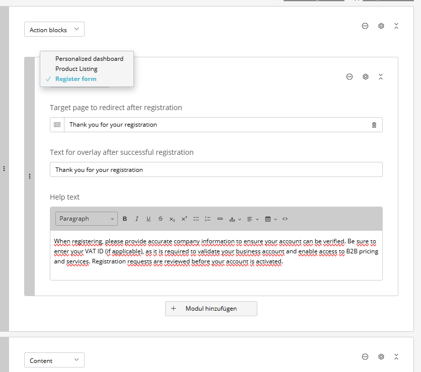

# SuluActionBlocksBundle


The **Sulu Action Blocks Bundle** lets you make application actions available as reusable blocks in Sulu. Editors can select an action in the Sulu admin, configure it when necessary, and place it anywhere in the content tree.

An action can either return HTML that is rendered at the position of the block or a redirect URL that is handled after the action has been executed.

<p style="display: flex; gap: 32px; justify-content: center;">
    <a href="docs/pics/action-block-examples.png" target="_blank">
        
    </a>
</p>

## 🚀 Features

- **Custom actions**: Connect your own application, forms or business logic to Sulu blocks.
- **Optional configuration**: Give an action its own global block and receive the editor's values in your service.
- **Editor friendly**: Editors select and configure actions through the familiar Sulu interface.
- **Twig integration**: Render one action block or a complete collection of action blocks with Twig functions.
- **Independent caching**: Give a single action its own HTTP cache lifetime and let a reverse proxy cache it as an ESI fragment.

## 🛠️ Installation

### 1. Requirements

- **PHP**: 8.2 or higher
- **Sulu**: 2.6 or higher and below 3.0

### 2. Install the bundle

Run the following command in your project root:

```bash
composer require perspeqtive/sulu-action-blocks-bundle
```

If Symfony Flex does not register the bundle automatically, add it to `config/bundles.php`:

```php
return [
    // ...
    PERSPEQTIVE\SuluActionBlocksBundle\SuluActionBlocksBundle::class => ['all' => true],
];
```

## 📖 Usage

### 1. Create an action service

Create a service that implements `ServiceActionItemInterface`. The service is the only application-specific part you need to provide.

```php
<?php

declare(strict_types=1);

namespace App\ActionBlocks;

use PERSPEQTIVE\SuluActionBlocksBundle\Execution\ActionExecutionResult;
use PERSPEQTIVE\SuluActionBlocksBundle\Registry\ServiceActionItemInterface;

final class FeaturedProductsAction implements ServiceActionItemInterface
{
    public function __construct(
        private readonly FeaturedProductServiceInterface $featuredProductService,
    ) {
    }

    public function getIdentifier(): string
    {
        return self::class;
    }

    public function getTitle(): string
    {
        return 'Featured products';
    }

    public function getConfigurationBlock(): ?string
    {
        return 'featured-products';
    }

    public function execute(array $options = []): ActionExecutionResult
    {
        return new ActionExecutionResult(
            html: $this->featuredProductService->getFeaturedProducts($options['product-ids'] ?? []),
        );
    }
}
```

The interface requires these four methods:

| Method | Purpose |
| --- | --- |
| `getIdentifier()` | Returns a stable and unique identifier for the action. `self::class` is a suitable choice. |
| `getTitle()` | Returns the name shown to editors. It is also used to generate the block name when no configuration block is defined. |
| `getConfigurationBlock()` | Returns the key of the global block containing the action's configuration fields, or `null` when the action needs no editor input. |
| `execute()` | Runs your application logic and returns an `ActionExecutionResult`. The values configured in Sulu are available in `$options`. |

Register any dependencies of the action as usual. With Symfony autoconfiguration, services implementing `ServiceActionItemInterface` are registered automatically. If autoconfiguration is disabled, add the bundle tag manually:

```yaml
# config/services.yaml
services:
    App\ActionBlocks\FeaturedProductsAction:
        tags: ['perspeqtive.sulu_action_block.action']
```

### 2. Add an optional configuration block

If an action needs values from an editor, create a regular Sulu global block in `config/templates/blocks/`. Its `<key>` must be the value returned by `getConfigurationBlock()`.

For example, the `FeaturedProductsAction` above uses the following block:

```xml
<template xmlns="http://schemas.sulu.io/template/template"
          xmlns:xsi="http://www.w3.org/2001/XMLSchema-instance"
          xsi:schemaLocation="http://schemas.sulu.io/template/template http://schemas.sulu.io/template/template-1.0.xsd">
    <key>featured-products</key>
    <meta>
        <title>Featured products</title>
    </meta>
    <properties>
        <property name="product-ids" type="product_selection">
            <meta>
                <title lang="en">Featured products</title>
            </meta>
        </property>
    </properties>
</template>
```

The values of the block's properties are passed to `execute()` as the `$options` array. An action without configuration can return `null` from `getConfigurationBlock()`; editors then select it by the title returned from `getTitle()`.

After adding or changing an action or its configuration block, clear or warm up the Symfony cache so that Sulu can update the available action block types:

```bash
bin/console cache:clear
```

### 3. Add action blocks to a page template

Add the `action-blocks` type to the block property of every page template where editors should be able to use actions:

```xml
<block name="blocks" default-type="text">
    <types>
        <type ref="text" />
        <!-- ... other block types ... -->
        <type ref="action-blocks" />
    </types>
</block>
```

The bundle adds each registered action to the `action-blocks` selection automatically. You do not need to add individual action types to the page template.

### 4. Render action blocks with Twig

Use `perspeqtive_render_action_blocks()` when rendering the complete value of an `action-blocks` property:

```twig

    {{ perspeqtive_render_action_blocks(module['action-blocks']) }}

```

To render individual entries, use `perspeqtive_render_action_block()`. Pass the complete block value; it must contain the `type` field generated by Sulu:

```twig

    
        {{ perspeqtive_render_action_block(actionBlock) }}
    

```

You can add values to the options passed to the action before rendering:

```twig

{{ perspeqtive_render_action_block(actionBlock) }}
```

### 5. Return HTML or a redirect

Return HTML when the action should render content at its position:

```php
return new ActionExecutionResult(html: '<h1>Hello World</h1>');
```

Return a redirect URL when the action should redirect the visitor after execution:

```php
return new ActionExecutionResult(redirect: 'https://example.com/success');
```

Only the HTML value is rendered by the Twig function. Redirects are handled by the bundle's request integration.

### 6. Cache an action block independently of the page

Action blocks are rendered while the page is rendered, so their output becomes part of the page's HTTP cache entry. If an action is expensive, or if it needs a cache lifetime that differs from the surrounding page, let it implement `CacheableActionItemInterface` in addition to `ServiceActionItemInterface`:

```php
<?php

declare(strict_types=1);

namespace App\ActionBlocks;

use PERSPEQTIVE\SuluActionBlocksBundle\Execution\ActionExecutionResult;
use PERSPEQTIVE\SuluActionBlocksBundle\Registry\CacheableActionItemInterface;
use PERSPEQTIVE\SuluActionBlocksBundle\Registry\ServiceActionItemInterface;

final class NewsTeaserAction implements ServiceActionItemInterface, CacheableActionItemInterface
{
    public function getCacheTtl(): int
    {
        return 300;
    }

    // ... the four ServiceActionItemInterface methods
}
```

| Method | Purpose |
| --- | --- |
| `getCacheTtl()` | Returns the shared cache lifetime of this action's output in seconds. It is sent as `Cache-Control: s-maxage=<ttl>` on the fragment response. |

Instead of being rendered inline, such a block is embedded as an [ESI](https://symfony.com/doc/current/http_cache/esi.html) fragment that points at the bundle's fragment controller. The reverse proxy then requests, caches and expires that fragment on its own, independently of the page's `<cacheLifetime>`.

#### Import the fragment route

The fragment controller is only reachable once the bundle's route is imported. Bundle routes are never loaded automatically, so add the import to your website routing:

```yaml
# config/routes_website.yaml
perspeqtive_sulu_action_blocks:
    resource: '@SuluActionBlocksBundle/config/routes.yaml'
```

#### Enable ESI

ESI has to be enabled in the framework configuration, and a reverse proxy that understands `<esi:include>` has to sit in front of the application:

```yaml
# config/packages/framework.yaml
framework:
    esi: true
    fragment: true
```

`framework.http_cache` uses Symfony's built-in reverse proxy and is the quickest way to get started. In production a dedicated proxy such as Varnish is the usual choice — make sure ESI processing is enabled there as well. Sulu's `SuluHttpCacheBundle` proxy builds on Symfony's `HttpCache` and supports ESI too.

Without a surrogate in front of the application, Symfony falls back to rendering the fragment through an internal sub-request. The page still renders correctly, but the fragment is not cached separately. The same fallback applies when `framework.esi` is disabled entirely — the action is then executed inline and a message is written to the `action_block` log channel.

#### Signed fragment URIs

The fragment URI is signed with the application secret, and the controller rejects unsigned or modified URIs with `403`. Only actions that implement `CacheableActionItemInterface` are reachable through it, so the endpoint cannot be used to invoke arbitrary actions with arbitrary options.

Signing covers the scheme and host of the fragment URI. If your reverse proxy terminates TLS or rewrites the host, configure [`framework.trusted_proxies`](https://symfony.com/doc/current/deployment/proxies.html) so that the application reconstructs the original URI — otherwise every fragment request fails with `403`.

#### What to keep in mind

- **Options travel through the query string.** The editor's block values are appended to the fragment URL, so the action receives them as strings. Cast them explicitly in `execute()`, for example `(int) ($options['limit'] ?? 3)`.
- **Keep options small.** Everything the action needs is part of the fragment URL, which is also its cache key. Large option sets make for long URLs and poor cache hit rates.
- **The cache key is the URL only.** Two blocks configured identically share one cache entry, which is intentional. If the output depends on anything outside the options, add a `Vary` header in your action's response handling or do not cache the action at all.
- **No redirects.** `ActionExecutionResult::$redirect` is not evaluated for cached fragments, because the fragment response is cached and reused. Do not combine `CacheableActionItemInterface` with an action that redirects.
- **Personalised output must not be cached.** A cached fragment is shared between all visitors. Any action that depends on the session or on the current user must not implement `CacheableActionItemInterface`.
- **A TTL below `1` disables caching.** The fragment response is then sent with `Cache-Control: no-store, private`, which is useful to switch caching off for a single action without changing the page.

## 💡 Example implementation

The [`docs/example`](docs/example) directory contains a complete, minimal setup:

- [`FeaturedProductsAction.php`](docs/example/src/ActionBlocks/FeaturedProductsAction.php) shows an action with a configurable global block.
- [`RedirecterServiceAction.php`](docs/example/src/ActionBlocks/RedirecterServiceAction.php) shows an action without a configuration block that returns a redirect.
- [`NewsTeaserAction.php`](docs/example/src/ActionBlocks/NewsTeaserAction.php) shows an action that is cached as an ESI fragment with its own lifetime.
- [`featured-products.xml`](docs/example/config/templates/blocks/featured-products.xml) defines the configuration block used by the first action.
- [`news-teaser.xml`](docs/example/config/templates/blocks/news-teaser.xml) defines the configuration block used by the cached action.
- [`default.xml`](docs/example/config/templates/pages/default.xml) enables action blocks in a page template.
- [`services.yaml`](docs/example/config/services.yaml) registers the actions without relying on autoconfiguration.
- [`routes_website.yaml`](docs/example/config/routes_website.yaml) imports the fragment route required for cached action blocks.
- [`framework.yaml`](docs/example/config/packages/framework.yaml) enables ESI and the reverse proxy.

## 👩‍🍳 Contribution

We welcome contributions! Please feel free to fork the repository, add features, and submit a pull request. To maintain high code quality, please include unit tests for all changes and update the documentation accordingly.
